### Erythrina
# Making assets

The first topics I will cover are asset creation. I will try to cover/use free or open source programs. Maybe this tutorials will cover less godot but they are important for every game. We will reach godot in just a while.

I was thinking about using GraphicsGale for drawing. I'ts not a bad program, has a free version, etc. Actually I do not like it because I found unintuitive some of the tools but for pixel art you do not need too much and I found that it fits well with godot animated sprites. But just a little ago I found ASEprite. It's a pixelated editor tought for pixelart, and is also open source.

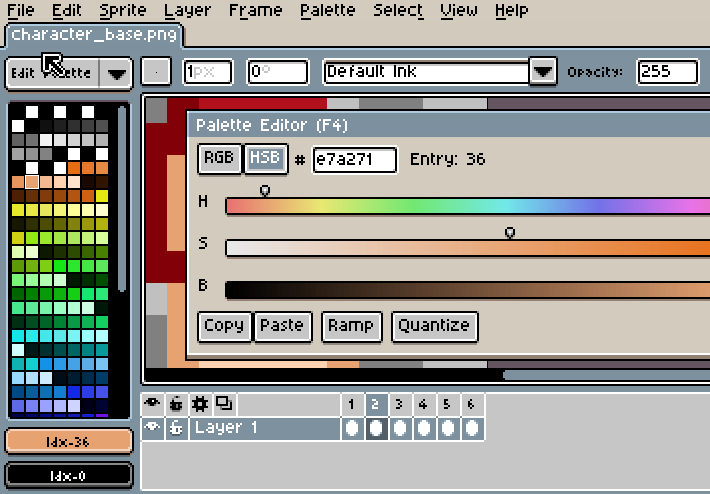

Just by opening it all the nostalgia comes out. First I thought that a pixelated environment will be annoying, but once get used it's actually very confortable. AESprite can work with layers, animations, export spritesheets, palettes, etc. And can fit well with godot engine animated sprite. 

For windows I'm using this compiled version - [link to zip](http://www.mediafire.com/download/a2p5m91lndrfw4g/Aseprite1.0.2-dev.zip) - because the lastest binaries are not for free but the source code can be found here - [link to github](https://github.com/aseprite/aseprite/)

## Things to know before drawing

Before going to the bare act of splashing pixels on the screen there are some things that must be considered. 

## The primary school stuff

First of all, you can't go there and just pick random colors. Did you experienced that feeling when you made something great but the colors just, don't look good, and you didn't know why. That's where just a little of color theory comes in. We will need to go trought some of the boring and basic stuff. 

I suppose that everyone know the basic and elementary colors.

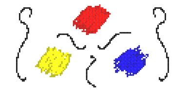

Yes, we are not using red green and blue like all the CRT screens are used to. It's true that RGB are the primary colors for screen and also red, yellow and blue are primary colors too, whats the difference. 

What happens is that RGB are light colors and RYB are pigment colors. The difference between them is how and what happens when you mix them. With RGB when you mix all the colors at full intensity the result will be white light. But when you mix red, blue, and yellow paint you will bucket of brown paint.

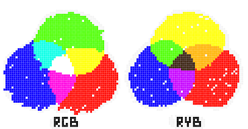
  
And on the mixing of red, yellow and blue paint is where the basic color is set. When mixing them in pairs you make the secondary colors. 

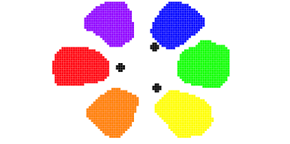

And then mixing a secondary color with a primary color you will make a ternary color. And after making all the combinations you end with a fancy wheel of twelve colors.  

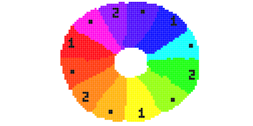

We could follow making this but 12 colors is all we need. Actually more colors will turn all the stuff worse.

But, we can't make all the game with just that 12 colors. Or can we? And where is the black and white?

Well, for physicists, the black is not a color and the white is a color. For chemists the black is a color and the white is not a color. But for this basic color theory, none of them are colors. They just vary the intensity and luminance of a color. They add shade (the addition of black) and tint (the addition of white).

And turning in the color wheel and changing the color is actually changing the hue of the color. And when we made a wheel of 12 colors we just restricted the hues the a little subset. But we still can tint and shade the colors and make lots of variations.

When a color doesn not have any addition of white or black then that color is at full saturation. Less saturated the color then more black or white has. The neutral could be any color at 0 saturation.

## Warm and cool

One thing that is important to know and is a little obvious at sight is the difference of warm and cool colors. 

The color wheel is split in two sections. 

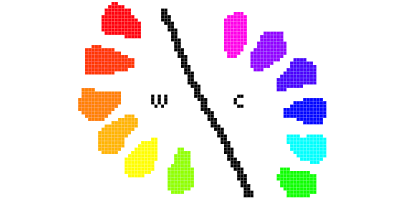

It's usefull to know what are you drawing and what feelings are you trying to transmit. For example the warm colors generally are energetic and vivid and cool colors are calm and in occasions sad. Try, for example, to avoid mixing warm colors  (at least in equal amounts) when trying to draw something that must feel cool. 
 

## Picking colors

The most important thing to know about colors is to pick the fewest possible. You must pick the minimum amount that will explain the picture. The less colors you pick the more 'harmonic' will look the picture. If you exaggerate and pick only one color everything will be monochrome and there will not be place for incorrect colors (there will be only one). 

For many things picking from two to four colors its just enough. The rest are just variations adding black and white. 

Here are some tips for picking colors and some use cases.

##### Complementary colors

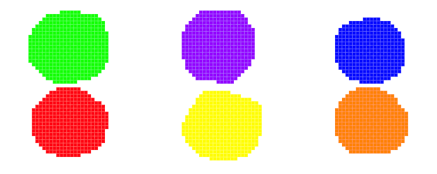

Just pick a base color, then pick the opposite color in the wheel. That color will be the complementary color. It will have de highest hue contrast so its not recommended to use them at full saturation. Its very useful to make things noticeable.

##### Analogous colors

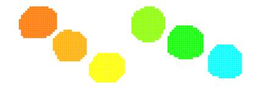

Pick a base color, and then pick the adjacent colors in the weel. This combination is usually very harmonious and confortable. It lacks of contrast and some usage of black and white is needed to add contrast. You can also combine it with the complementary color for something that must be really noticeable.

##### Split complementary colors

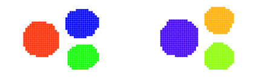

Pick a base color and then, instead of picking the complementary pick the analogous colors of the complementary. You will have almost the same contrast as the complementary but its easier to use and more confortable to the eye.

##### Triangle colors

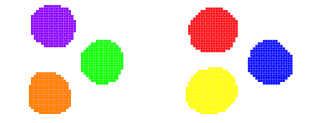

Pick a base color and then chose another two making a triangle in the wheel so the three colors are evenly spaced. 

##### Square/Rectangle Colors

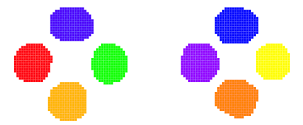

Pick two pairs of complementary colors. The result may be versatile enough to have some good contrast and good harmony. You will also have the same warm colors as well as cool colors. This combinations work better if one color is the dominant.

-

All the colors here maybe may look too simple and colorful. But everything else is in the variation. Taking a set of analogous colors you could make something like this.

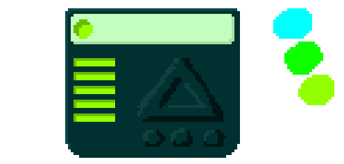

And I really don't know what is that. But in that thing there are only three colors and everything else is just tint and shadow. And that colors are the same (have the same hue) that the ones on the right. It blew my mind the first time I saw it.

If you want to draw something more realistic you are not restricted to a small set of colors, but they will help as guidelines for the other colors. You always can use a base paint in basic colors and then paint more colors, shadow and light over until everything look gorgeous.
