#Erythrina
# Making assets Part 2

Because only one part its not enough, and in the part 1 we actually didn't did any assets, holy moly. 

Lets strat drawing something. We will open a new 16x16 image, we will load the palette, and then we will make the body and place his eyes.

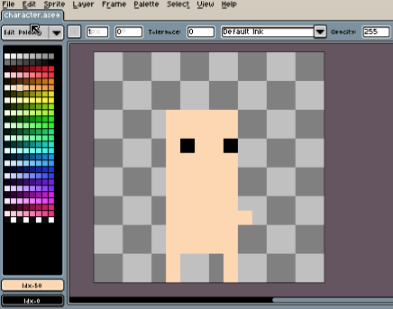

This will be the body shape for all the human-like characters and we will use its size for reference for almost anything. It's sizes are, 2px of legs, 5px for the body, and 5px for the head without any hair. And the arms, or how may be called that little dot, will be in the center of the body.

Now this sprite seems just plain. Its actually plain, but it should feel just a little, more, alive.. or something. We first will add him some volume, shading him just a little. We select his skin tone, and then we select the next tone which is a little bit darker. Then we shade a line on him like if he was a box.

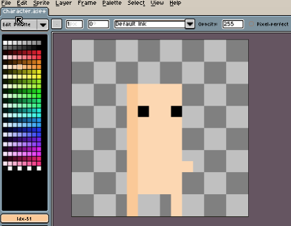

Whoa, now he has dimension. But there are some things missing. Like his right arm. Lets shade a little more.

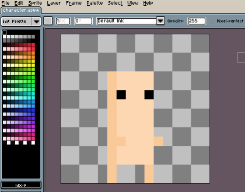

Ok, its done. The bald base sprite. Now we have to animate it a little. We need an animation when he is idle, and one when he is walking facing right. Then we will make the same old trick to flip it horizontally to make the left side animations.

## Idle animation

Lets start with the easy part, the idle animation.

With Tab you can open the Layer/Timeline panel and then with Alt-N you will add a frame to the animation. We will erase his eyes in this new frame so they will appear like he is blinking and then will press Enter to play.

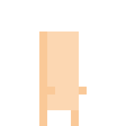

Its fine but more than blinking he is like trying to hypnotize something or had a blinking eye disease. The first solution is to add more frames with the eyes open but that will lead us to modify every frame each time we will need a modification. Instead of that, we can set the frame time just making double click on the frame number or pressing P. 

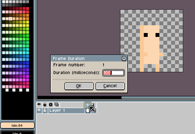

Lets give it like 1200ms for the first frame and stay with the 100ms for the frame with the eyes closed. 

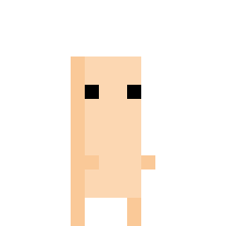

A long way better, but he blinks at a constant rate of ~46.15 bpm, and its kinda annoying. So I will inevitably duplicate this frames and change their duration to give him a little more humanity. I will put 2000ms for the second blink so we end with this blink animation which is a little bit better.

Actually we do not need to save two duplicated blinks in the sprite. The animation in aseprite its just for test and later we will make the animation again using the Godot animator. So for now we can throw the duplicated frames out and just remember to duplicate them later.

One thing that I dont like is his arms, they are lifted up, luke pinting towards something or holding something. I will let them down for the idle position. Actually they will disappear when they are down so we end up with this.

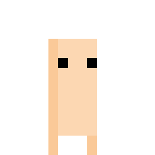

Its arms 'disappeared' in some way, but just because he is naked. Oh, no, I've been drawing naked pixel people for the last two pages. Oh, lets put some clothes on him. 

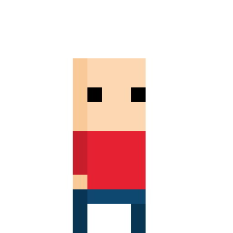

Good, God, finally, no sin. Ok, and, yeah! His arm is right here! But he still bald, although it's nothing bad about being bald. I will call him Little Bald Boy. 

He doesn't feel alive. He blinks now, but hi lacks the breath effect and for this time, we will not animate his breath. Because if we will try to move him just a little, we will move him by just one pixel. But that pixel will be actually too much. If we make animations like this ones.

   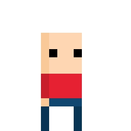       

It will be too much. The second one is also a little disturbing, you really know how to breathe Mr. Little Bald. 

So, we will desist on using breath animations here. And the lifeless style for sprites will be part of this game series. This will be our idle animation for now.

Now, the running/walking animation.

## Walk animation

This is a little bit harder one. Here the character will actually move. First of all we have to know the basic walk cycle so let me draw it.

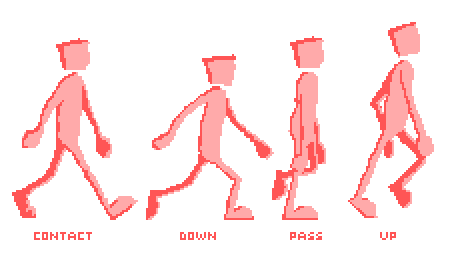

These are the basic keyframes for one step of the walk cycle (the whole cycle is two steps for normal human people). The other step is the same but just swapping the left leg with the right, and the arms too. I'm just lazy to draw it now.

This frames are enought to show well the movement of the legs, the arms, the bending of the knees, etc. And they explain themselves. 

The contact phase is when the front foot collides with the floor, more precisely the front foot heel. 

The down phase is when the character lower his body to gain impulse for the next step. Here his head and body are slightly lower and the back foot is rising from the ground. Also in this phase is where the hands are farther away.

In the pass phase one leg is generally straight and the other is bended and excited because it's going to be the new front leg. The head it's at the same level as in the contact phase. Also, the arms generally come back close. I generally use this frame as the end frame for a walk, afther this one the standing idle phase fits wery well.

And the last is the up phase, it when the front leg is rising high and the whole body will rise too. The back leg is stretched and he is standing in his toes. This is a good starting frame for a walk animation, the first thing you will do when you'll start walking is to rise your foot.

After the up frame goes the contact frame again and the whole thing repeats over and over.

These frames are very good but now we need to apply them on our Little Bald Boy. One bad new, he doesn't even have knees. And also he is standing in some sort of perspective in which he is half facing the camera but can walk sideways like a crab. 

So, lets draw him like a crab.

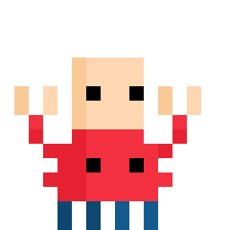

Yes, I'm losing the point, but he is lovely, yes you're lovely Mr. Little Bald. 

Jeez, ok, concentrate, concentrate. 

What we will do here is to rip off some frames and simplificate a lot. The entire walk cycle will be only 4 frames. We will have the same up phase but the other tree phases will be combined in one strange phase which we will creatively call it the "contact-down-pass" or CDP. On the CDP he will contact the ground, lower a little, and his legs will be somehow in a passing position.

So our first try with the legs is awful.

It's more like he were stretching his legs making exersise. They are too far away, lets just, put them a little pixel closer.

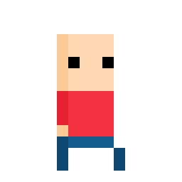

Just moved the back leg a little forward and magic happened. And moving the front leg back gives the impression that he is running. Also lowered his head and rised his arm. 

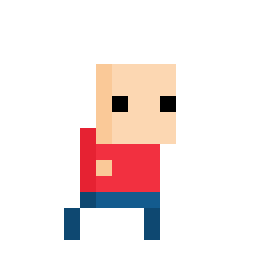 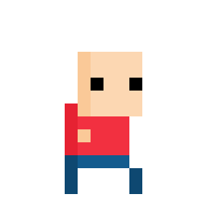

But I do not like this one. He is more like a Little Bald Old guy, but hey, there's one important thing. If we lower his head that gives the effect that he is older.
 
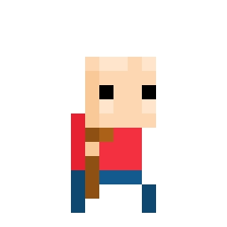

And a cane generally makes the rest of the job.

But lets go back to the normal Little Bald Boy. He's walking fine but his arms does not move. Lets just add a little of life there.

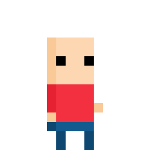 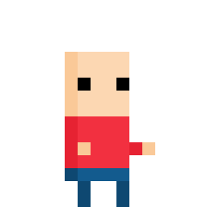 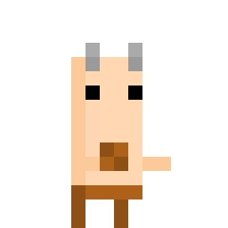

The trick with the hands is, wait what.. a faun... ok. The trick with the hands is that they are alternated respect of the legs and that they move before the legs. When the leg is reaching the front, the arm is heading to go back again.

And this is all for now. We clean up our image so there are no duplicated frames and save our .ase file. Now lets import him to Godot and make him move just a little.

### Continues [here](03_our_character_in_godot.md)