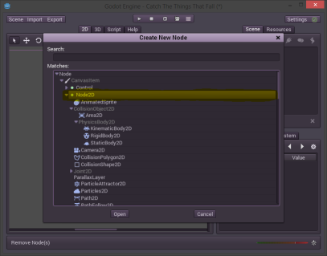

### Erythrina
# Our character in Godot


Now, finally we will start with Godot. We finished our Little Bald Boy sprite and animations so its time to put them into Godot and see what happens. But before we have to create a project. 

First we have to create a folder for our project. Every resource, every script will live inside that folder. I will create it in "projects\catchthethingsthatfall". 

Our resouces like animations will go there also but because I will reuse them for many games, and because the .ase is useless I will save it in the assets folder separated from the projects, and I'will only store with the projects the exported assets.

So, we download Godot from the website - [link](http://www.godotengine.org/wp/download/) - place it somewhere nice, and then we open it to find this screen.


This is the project manager and from here we, ehm, manage our projects. We are new here so we will create our new project clicking on the shining "New Project" button.


A dialog opens asking for our secret information about where we will store our project and how we will name it. We tell him our secrets and the path to our recently created folder. And we end up with the project listed in the projects list.


We double click on our new project and a new world of possibilities shows off. Also we found ourselves in a new and maybe strange envirnoment but is actually kind once get used.


Here we will jump many Godot concepts, but there are someones that we need to understand before we continue.

In Godot almost anything is a Node. And what is a node? Is the basic unit that's used to create our game. Technically a Node is an object wchich has a name, has properties, has other nodes as children and can bi extended via scripting.

So, here, in Godot our game isn't more than a simple Tree, which is a collection of nested nodes.


_Image taken from wiki_

Each node can be almost anything in our games. For example a node can be our level, and another node inside can be our character, who actually can have a nested node of a weapon. This is one thing that make Godot exquisite for making games, because this gives you natural organization of your game, an local context each time you go inside a node one more level.

After the concept of Node comes the concept of Scene. A Scene is actually nothing more than a tree of nodes. Again it's very simple. But a scene have the following adventages, it can be saved and loaded, they can be instanced, and they can be run.

What means all of that? When we design and create our game we usually organize it in scenes. So we work with it as scenes. Maybe each scene could be a level. Maybe each scene could be an object of the game, the possibilities are infinite. 

By instancing we mean to, create an object of the same characteristics that the scene. And this part is actually very important to Godot because it leads you to reuse many of the objects in your game. You just create a Scene, which is a bunch of Nodes in a Tree, then you just instance it in another scene, inside another node, and the whole Tree is cloned there. And you can do this all the times that you want. You can create a scene with all the logic, sprites, and animations for a headcrab and then in your level scene create a machine which creates (instances) headcrabs, many of them, enought to take down a country or a CPU. 

The last thing about scenes is that when you run your game, you are actually running a scene. 

I think that this was a very short and uncomplete intro to Godot but it's enought for now, the rest will come out on the way. I you are impatient to learn more here is the - [link](https://github.com/okamstudio/godot/wiki) - for the Godot wiki.

Now we will focus on our games and what we will do to have it working. 

First of all, oh. I'm tired of saying that, I've said that like 20 times.

Before anything else (better) we have to create a Node for our level. To do this we go to the right panel and click on the icon or press Ctrl+A.


A menu will open with a whole world full of nodes. It's like a candy store of nodes, of all the colors of the rainbow. One important thing to know is that the red nodes are 3D, the green nodes are user interface nodes, and the blue ones are 2D nodes. Here we will be using 2D nodes and also some of the user interface nodes later.


So what we do is to select a Node 2D and use it as the root node for our level.





And after that we end up with a nice view of our brand new Node2D in our 2D view shown as that little gizmo. With that gizmo we can move, resize or even rotate our level.


But for now we will not touch it, and actually to not run in trouble we will lock it.
Locking things that you are not using now is actually a very good practice. You never know when you could sneeze and resize anything in your game. It's worse when you didn't see it until it's too late and you have to go and fix it on a sunday morning inside a pool full of acid and sharks with laser guns in their heads. If there is a lock button, it's there for something, think about it.


And I forget about something, rename our node. The names of the nodes are important for Godot and for you because you will use them to reference other objects in the game. Also its a pain to have a whole Tree full of "Node2D" things that you don't know what they are until you click them each one by one. So I will name that node "level_1" by clicking twice on it's name. Sweet and easy.


Don't forget about hitting Enter because if not, it will discard your change. The same applies for almost any value entry in Godot, so remember, press Enter, or the sharks with laser guns will come for you.


### WIP ( I need to sleep, I'll continue later ) 


<!---
## The size matters
```
One important thing is to have something for reference when drawing stuff. 
You do not want a knife to be of the size of a skyscreaper, 
or a whale of the size of a bean (except when that is the intention).
```
```
You shoud get some reference sizes to, for examle, 
make doors of the same size of the character. 
Make weapons so they look well near the character. 
And yes, you are right, the character is a very good 
reference to have at hand.
``` 
-->