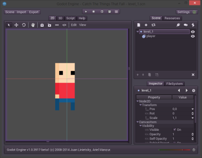

### Erythrina
# Our character in Godot


Now, finally we will start with Godot. We finished our Little Bald Boy sprite and animations so its time to put them into Godot and see what happens. But before we have to create a project. 

First we have to create a folder for our project. Every resource, every script will live inside that folder. I will create it in "projects\catchthethingsthatfall". 

Our resouces like animations will go there also but because I will reuse them for many games, and because the .ase is useless I will save it in the assets folder separated from the projects, and I'will only store with the projects the exported assets.

So, we download Godot from the website - [link](http://www.godotengine.org/wp/download/) - place it somewhere nice, and then we open it to find this screen.


This is the project manager and from here we, ehm, manage our projects. We are new here so we will create our new project clicking on the shining "New Project" button.


A dialog opens asking for our secret information about where we will store our project and how we will name it. We tell him our secrets and the path to our recently created folder. And we end up with the project listed in the projects list.


We double click on our new project and a new world of possibilities shows off. Also we found ourselves in a new and maybe strange envirnoment but is actually kind once get used.


Here we will jump many Godot concepts, but there are someones that we need to understand before we continue.

In Godot almost anything is a Node. And what is a node? Is the basic unit that's used to create our game. Technically a Node is an object wchich has a name, has properties, has other nodes as children and can bi extended via scripting.

So, here, in Godot our game isn't more than a simple Tree, which is a collection of nested nodes.


_Image taken from wiki_

Each node can be almost anything in our games. For example a node can be our level, and another node inside can be our character, who actually can have a nested node of a weapon. This is one thing that make Godot exquisite for making games, because this gives you natural organization of your game, an local context each time you go inside a node one more level.

After the concept of Node comes the concept of Scene. A Scene is actually nothing more than a tree of nodes. Again it's very simple. But a scene have the following adventages, it can be saved and loaded, they can be instanced, and they can be run.

What means all of that? When we design and create our game we usually organize it in scenes. So we work with it as scenes. Maybe each scene could be a level. Maybe each scene could be an object of the game, the possibilities are infinite. 

By instancing we mean to, create an object of the same characteristics that the scene. And this part is actually very important to Godot because it leads you to reuse many of the objects in your game. You just create a Scene, which is a bunch of Nodes in a Tree, then you just instance it in another scene, inside another node, and the whole Tree is cloned there. And you can do this all the times that you want. You can create a scene with all the logic, sprites, and animations for a headcrab and then in your level scene create a machine which creates (instances) headcrabs, many of them, enought to take down a country or a CPU. 

The last thing about scenes is that when you run your game, you are actually running a scene. 

I think that this was a very short and uncomplete intro to Godot but it's enought for now, the rest will come out on the way. I you are impatient to learn more here is the - [link](https://github.com/okamstudio/godot/wiki) - for the Godot wiki.

Now we will focus on our games and what we will do to have it working. 

First of all, oh. I'm tired of saying that, I've said that like 20 times.

Before anything else (better) we have to create a Node for our level. To do this we go to the right panel and click on the icon or press Ctrl+A.


A menu will open with a whole world full of nodes. It's like a candy store of nodes, of all the colors of the rainbow, flowing down from the mountain, from the [mountain](https://www.youtube.com/watch?v=I2mRQx-b_OE). One important thing to know is that the red nodes are 3D, the green nodes are user interface nodes, and the blue ones are 2D nodes. Here we will be using 2D nodes and also some of the user interface nodes later.


So what we do is to select a Node 2D and use it as the root node for our level.


And after that we end up with a nice view of our brand new Node2D in our 2D view shown as that little gizmo. With that gizmo we can move, resize or even rotate our level.


But for now we will not touch it, and actually to not run in trouble we will lock it.
Locking things that you are not using now is actually a very good practice. You never know when you could sneeze and resize anything in your game. It's worse when you didn't see it until it's too late and you have to go and fix it on a sunday morning inside a pool full of acid and sharks with laser guns in their heads. If there is a lock button, it's there for something, think about it.


And I forget about something, rename our node. The names of the nodes are important for Godot and for you because you will use them to reference other objects in the game. Also its a pain to have a whole Tree full of "Node2D" things that you don't know what they are until you click them each one by one. So I will name that node "level_1" by clicking twice on it's name. Sweet and easy.


Don't forget about hitting Enter because if not, it will discard your change. The same applies for almost any value entry in Godot, so remember, press Enter, or the sharks with laser guns will come for you.

Silence and a small pause to think about it. Lets continue.

One important thing to have in mind when you are working on this is, what are you doing actually? And then I forgot to explain what we are going to do. And yes, we are making a game.

I know that in the introduction I said that I will be working on a game and working on it over these writings. But for the sake of getting things done, I will be making some small games by the way. There is nothing more comforting than seeing something finished and working. And there is nothing more frustrating than aiming for a game that must be the master piece of your life and failing over and over. 

So is that we will be making our first little game, a small "CatchTheThingsThatFall" game that explains itself. There will be: Our character, some sorts of things that can fall, a little environment, and some UI.

What things could fall? Surprise. There will be basically two sorts of things. Things that kill us, and things that give us points. But we don't have them yet so, lets do not worry about them. At first we have to put our character in here and then to move him a little. 

Thus we will add another node inside the level_1 and now we will select the AnimatedSprite for this one. Then rename it to "player".

Then we could set the sprite to the one we made before but, we actually didn't exported it. So lets export it first.

There are two ways to store a sprite and both work fine. One is to use a spritesheet like this one.


And the other one is to store all the frames in separated files.

Godot work well with both, but we will chose to store them in separated files because Godot have a really nice sprite manager to work in that way.

So, if you were curious them you've noticed that ASEprite has an option to export the spritesheet but doesn't have an option to export all the frames in multiple files. That is because its actually implicit. To export an animation to multiple files you just have to save the file to a format that doesn't support animations (.png it's highly recommended because it doesn't lose quality and support transparency). It will save multiple files numbered with the frame number. Then all the export process it's just to press "Save copy as" and save it in our project folder.

I will create a folder inside our project folder and in some rush of inspiration I will put it the name "player". Then we will just save a copy of our happy .ase inside that folder in the .png format. And we will end up with something like this.


Easy enough. Now we will import these frames inside Godot. We will go to our AnimatedSprite node "player" and we will take a look at the inspector.


I've said that each node has properties, and there is where are all (the visible) properties. Each kind of node has it's own properties and they can also be extended with properties of a script. This particular node is an animated sprite, and one of it's fundamental properties is the sprite and frames themselves. Lets give them a closer look.


This is the property that stores a SpriteFrames type object. We will not enter in little details now and we will just open the dropdown menu and select "New SpriteFrames".


After that we will have a new empty SpriteFrames object created and we just have to edit it. So we will click on the however it's called ">" symbol to go to the SpriteFrame editor.
 


And then we will have an empty window with a menu. From that menu we will select the folder icon which intuitively means open to actually open our recently exported frames.


Then we just go to our images and select them. We can select multiple files, like almost everywhere, holding Ctrl or Shift.


And as a result we will have all our frames imported and listed in the frame editor.


We can go back to our scene clicking on the "<" arrow in the inspector menu or going to the scene tree and selecting any node from the scene. 


And by surprise we will find our sprite there, standing and looking at us. We can move him and have fun imagining a whole new world and our own laws and currency system. But why is he blurry? It's actually ugly. We don't like blurry things, we want pixels. Whyyyyy!? 

The answer is "interpolation". When we scale an image there are different filter algorithms applied to the image to make it look good. Some of them are Linear/Cubic/Bilinear/Bicubic/Bi-etc interpolation. They are good for photographs because they soften the image colors, but not for us. We wanted each pixel to look sharp and because of that we do not want to use them. 

So we will go to the project settings and disable the image filter. 


There are many options which we will not touch for now. Now we have a blur problem and we need to solve it. 


And after that we close the settings and then we sadly still see the blur in his face. That's no problem, it's just that the editor needs to be restarted to take the changes. So we save the scene in the project folder, I will call it "level_1.scn". Close and open evenrything again. Then we take a look at our sharp and big pixels.





If you closed the project and after opening it again the scene is not opened you just need to open it from the Scene menu. By default the scene that opens is the project main scene, but we haven't configured one yet.

Now what? Lets animate him.

## Animator

From all the nodes, there's one node, to rule them all. This node has the power to control all the other nodes, to bend them against their will. This node is the AnimationPlayer node. And we will invoke his power. 

So we will select our player, go to the candy node store and add a AnimationPlayer node to him.


And after that, the power of the animator will reside inside the player node. And we can use its power at our will.


<!---
## The size matters
```
One important thing is to have something for reference when drawing stuff. 
You do not want a knife to be of the size of a skyscreaper, 
or a whale of the size of a bean (except when that is the intention).
```
```
You shoud get some reference sizes to, for examle, 
make doors of the same size of the character. 
Make weapons so they look well near the character. 
And yes, you are right, the character is a very good 
reference to have at hand.
``` 
-->