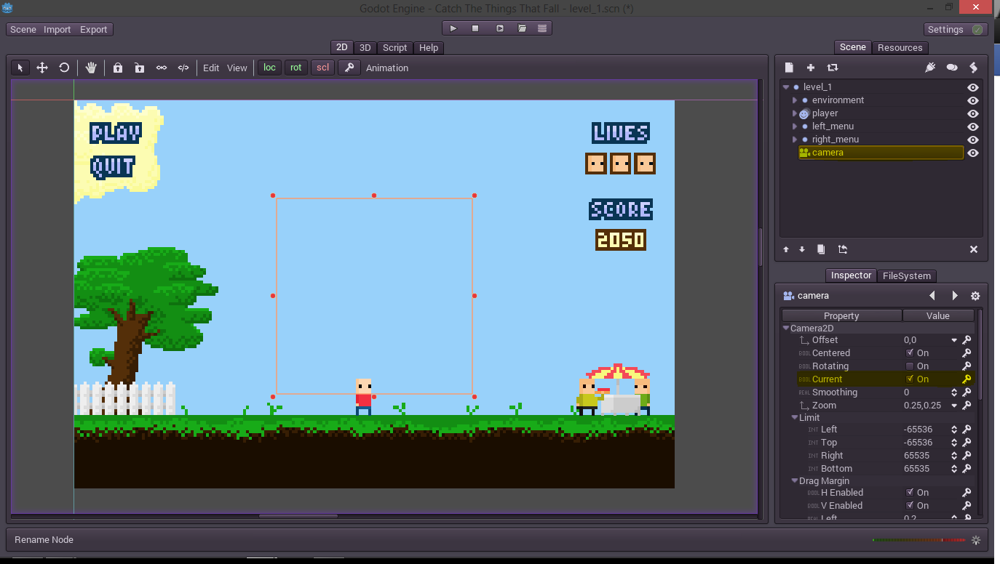

### Erythrina
# Drawing the environment

First, first of all. I lied. I've said that we will start with the code but. I just forgot that our Little Bald Boy is just floating in the void. So I've decided to draw a place to be for him and animate that environment.

This time I'll not be doing a tileset, instead of that I will draw everything in aseprite and then export the layers.

One important thing we need to know is the size. We have a very small sprite for Mr Little Bald, less than 16px. And we dont know where this is gonna be played. After some estimations based in the proportions of a squirrel I thought that 127h x 196w are good proportions. They are actually a little big but we have not to forget the gui. Everything will be scaled up in the end like three or four times.

So we start with a base image with a base color for a base sky.


Then we need to know what are we drawing. Because an image explain more than thousand pixels we draw a mockup of what are we doing in another layer.


There are things (I have to decide what are those things) that will fall from the sky and then there's a space for a menu on the left, a space for the meters on the right, and more space to fill up with drawings for now.

One important tip is to not lose the size reference. I've drawn a reference for the sprite in the mockup. We do not want to draw a car of the size of a building or a whale of the size of a bean, unless that is the point.

Actually I lied in the fact that I do not know what I'm drawing. I'm actually drawing whatever comes to my head while I'm writing this. So I search in my head and deep in my thoughts the only thing that I find is food. Yeah. I'm a very emotionally deep person.

Little Bald Boy is a hungry boy who wants to eat food, and then, suddenly, food falls from the sky. If there's no problem with Sony Pictures Animation for stealing their idea we can go on. There also will be bad things like radioactive waste barrels, knives, bones, and squirrels which will harm the player.

So we will picture that he is in a park. One important thing a park could need is grass.


It's not the best grass but it's a starting grass. But if we just cut the ground in half it hasn't grass everywhere. So we could add some dirt.


Also it's not the best dirt. To fix it, at least a little, we will add some pixel dithering, a darker dirt and more dithering.

What is dithering? When we do not have colors between two tones and we need to do a gradient effect we put some pixels of one color over the other color and vice versa. They may be randomly distributed or in a pattern. Hmmm, it doesn't sounds like a good explanation so an image will explain it better.


This may not be a good example because it's too small but the intention is there. I can't explain more because it come as a feeling, is like "OH! A pixel must go here" so may advise is, listen to your heart. :) 

After adding a darker shade of dirt and more dithering we end up with this.


I've also added a little dither on the dark shade of the grass.

Now we need to limit the player area with something. Let's draw a fence and a tree to fill the space on the left. 
 
Let's start with the fence. (Advise: Use layers. If you don't use them the sharks may come. A weekend someone could say "Hey, can you move that fence a little?" and you will have to redraw a lot just for that f#$%& fence.)


That's a nice basic fence but is a little monotone. Let's shade it.


Now to draw the tree. The tree will be behind the fence so we can just hide that layer and draw the tree (Also in another layer).


We draw a tree only in its base colors. It may look very bad but it's just the lack of shade what makes it look bad. So we shade it.


It is better now but we just marked the sites where we should add more shade. And because the tree is big, and because we love it, we will dither that shadow.


A whole way better. We just have to bring back the fence from the invisible void. And voilà.	


Now we need to cover the right side of the park, or whatever. We will make a hotdog stand and some folks around. And a fat guy who will not let anyone pass.

Let's draw the stand.


Now it's a little too simple but it only needs shading. And some stripes, everybody loves stripes.


After that we only have to draw some guys in other layers. The seller is the same as the character but with different colors, but the fat one is just, fat, just more wider. And also he is eating a hotdog to, complete the picture.


And I thought that some balloons could make the scene a little more, oh, how's called that feeling, oh, happy, that thing.


Ok, this is ok for now. 

Now it's time to scratch some menus, at least a concept. I will start writing again the text in a small font and in colors. And painting the heads of the lives.


The blue font is almost invisible and that's no problem, we will fix that in one second. First, shade, always shade. 


Also notice that the colors are complementary. And now to fix the contrast problem. 

When you have some text, subtitles for example, and they are white and it's late at night in the movie, its all ok, but when comes a scene with too much light or maybe a travel on a cake boat in a milk river, the text will just disappear. To fix that we can add an outline to our text. That outline itself will make contrast with the text and anywhere we could put that it will always jump off from the screen (not literally). 

So we add a darker outline to our text and we will be capable of seeing our text from many miles away.


And that will make it for now. I only will add something like a cloud behind the menu, drawing it like the leaves of the tree. It will also appear only when you are not playing, I guess.


Adding our Little Bald player, a little falling hamburger prop and a explanatory dialog completes everything.


Now the tedious part. Everything here is a nice image but its only that, an image. Many things here have different functions and many things could be animated. For example the fat gut eating a hotdog, the balloons, the grass. Also things like the lives or the score will change during game, so that things have to be separated from the background. And that's why we only made this image as a concept, we have to slice it in many images.

Could we have done all the things in parts and directly godot? The answer is yes, but it would have been a bit more tedious (in the beginning). And many times in life a designer just gives you a .ps or something with all in it and you have to let the magic happen.

After applying crop, flatten, make layer from background, to almost 15 files I'm reconsidering what is more tedious. And after 1 hour I think that making everything in a separated file and moving it in Godot is a way faster.


But after a whole work exporting, animating, and placing everything inside godot we end up with the same scene.


And also I will start to speed up a little to end up faster and continue with more interesting things. 


## Putting it all in godot (again)

Everything I did here was to add animated sprites, sprites, a camera and texture buttons which I will cover in short. I also used empty 2d nodes to group and organize everything. The layout ended up in something like this.


And if we move, for example, the right menu, we will also move everything inside it. 

All the anim nodes are for each object which is animated, almost everything here.

There are some things that I forgot to tell. Apart from the filter we also need to disable the "gen_mipmaps" in the settings. The mipmaps are prescaled, smaller versions of the pictures to optimize the textures. But our textures are actually small and we don't need mipmaps. Without disabling them I end up with almost the same blur effect as if the filter has been turned on, don't know why if I'm upscaling.

Another important thing is the "use_pixel_snap" you can turn it on in the project settings and also in the editor here.


It really helps a lot. Without it you will have everything misaligned and separated by 0.000001 pixels in the best try. Or you'll have to input the coords manually for every object. I've read this somewhere "Snap to grid. Snap to pixel. Snap until there’s nothing left to snap to." and it's an absolute truth.

Then, another important thing is where's the origin of your image. You could snap the origin of the image anywhere but if the center is just in half a pixel you're fu%&/ up. Thus always try to, or use pair size for the images, or easily put the origin at the top left of the image. Just clicking here.


And then nothing will be misaligned.

Another thing that I've forgotten is to mark "autoplay on load". On each animation that must be played from the beginning we have to simply press this.
 


And then that animation will be played on start. Simple as that.

## Chaining animations

One interesting thing that you can do with the Godot animator is to call functions on objects during the animation. And with this power you actually can change the animation an thus chain multiple animations. For example you can chain a "punch in the face" animation so when it ends plays the "idle stand" animation.

To do so we need to create a custom track in the animator, we need to create a Call Func track. (Yeah [funk!](https://www.youtube.com/watch?v=gjKFCYzqq-A)) So we click and hold on this menu. 


And then we will select our Call Func Track to add it to our animation.


I actually added one in the sky animation, because I added one "danger" animation which makes the sky blink in red. Because we added the track manually we have to enter the target object on which call functions here.


The dot here targets the parent of the animator and after that it works like a filesystem path. And because we need to select the animator itself we just put "./anim". And now we can add keyframes where we will call functions. First we need to know which function to call, so we go to the help tab and look for the function to play an animation in the AnimationPlayer.


Godot did it wery well on having all the api reference inside the editor.
I will not enter in details, but I will say that the only thing we need to pass to the ```play()``` function is a string with the name of the wanted animation. 

Therefore we will go to the desired position in the animation and we will add a new keyframe clicking on the yellow plus sign on the right of the track.


Then we will Ctrl-Click on the new keyframe to edit it or we will press on the pencil icon in the animation editor and then click on the keyframe. 

In the edit windows we will put the name of the function ("play"), set the number of arguments to 1 and put a string with the value of "normal" which is the animation with the blue sky.


And that's it, on that keyframe the animation will change to the normal animation again. 


## Texture button

Between the nodes that Godot has in his candy store. There are a whole bunch of them to simplify the process of making the GUI. One of them is the Button, which inside has all the logic to be pressed and send actions to scripts or other nodes. 

From that node inherits Texture Button, which has the same logic but comes represented by an image. We only have to define the images for the different states of the button and we're done. 


I've actually made 3 images to highlight the button when the mouse is over and when it's pressed. The states which are not used can be null and they will default in the normal state.

Another thing we must do is to set the button size. The image may be 10x10 but if the size still set in 40px we could click it from an unwanted place and let the chaos begin. Just set the Control/Rect/Size to the same size as the image and you're done.

Soon we will add logic to that buttons. But now we need to fix the size of the screen, it still like 127px wide. It's less than the resolution of a Game Boy Advance. Ug, I think that I've exaggerated a little with the small size. However, let's add a camera.


## Camera

Now that everything is placed inside our scene we could just scale up the whole "level1" node. But that's not the best way to do it, because we will have a mess up with our coords.

Another way to do it is to set up a camera, and zoom it. Everything will be in its place and we will have more control over the viewport of the scene.
All we have to do is to add a Camera2D node, and after that set it as the current camera.




If you want the camera to follow something, it's good to have its origin in the center because you can just center it on the player. But here the camera doesn't move and we know all the sizes so we'll set the "centered" bool off. And then we'll move it to the position 0, 0 so its well aligned.

Then just a little below we have the zoom property. It's actually inverted and we need to put a quarter to have a x4 zoom, so let's do that. After that we only have to go to the project settings and set the display widht and height to 784x508, which is the awkward size of 196x127 scaled up four times. Also we may want to set the resizable option off. 

And then when we play our scene we will actually see how.. oh.. I've never explained how to play the scene or actually how to run the game. By clicking on the play button will play the game, but the game needs a main_scene set up in the project settings. We just have to point it to our level1 scene. I still don't know why I didn't set it before.

Another thing that we could do is to play just the current scene by just clicking this button.

  


Do not forget to lock everything when you're done. Nobody wants shark shaped velociraptors in its weekend.

### Now let's move to the [code](05_coding_our_character.md)