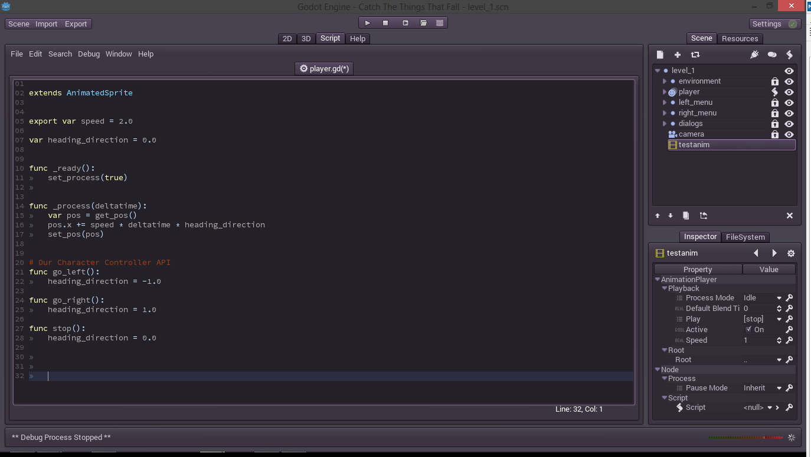

### Erythrina
# Coding our character

Yes, finally, something useful. Maybe, I hope. In the last tutorial, or chapter, or whatever, I actually forgot the ballons and the dialog. It was more of the same, add an animated sprited, add an animator, etc, repeat. But I've placed the dialog like the menu, inside another object actually called "dialogs" because we will make more of these. With this covered let's move to the code itself.

Let's recap we need to do:

- We need our character to move left and right
- We need some controls keys, and also touch the screen so we can port it to mobile later
- We need some falling food, and other things, like chainsaws
- We need to update the score and lives
- We need to die (yes, we all  die)
- We need to get the menu working, and change the game state from menu to playing

Then, when everything on that list is done, we could add other stuff like jumping, items, buffs, etc, etc. But first, and important, we have to finish everything in that list so we can enjoy our little finished game. Actually I'm saying that more to myself, because I'm writing this in some sort of self punishment. Also to take an habit and practice english. IF YU CAN RED THIZ IM DUING FINE. 

So, we need to start. 

## Adding scripts to a node

Godot uses their own script language called GDScript. They have their reasons to use it and they are out of discussion. But the good news are that it's almost like Python. Almost anything in the sintax is borrowed from there, but there were added, or changed, some keywords to accommodate to the engine. The full reference for the language is [here](https://github.com/okamstudio/godot/wiki/gdscript).

Also I will not stop in programming basics. I will try to explain the code, step by step, but only in functionality and relevant api stuff. Any detail about a function can be found in the reference, in the help tab at the right.

For anyone coming from Unity3D, or similar, adding a script is almost the same as adding a behaviour. We can inherit from another script or something but we can't add multiple scripts to a node. Sad but it's fine. If we need to compose an entity from multiple behaviours we can compose it with more nodes. Hell yeah. But not now. If you didn't understand anything of above don't worry. I didn't said nothing, I got distracted. 

Here, we want to add a script to our character so we will head for his node. In Godot there are two ways of adding a script. One is to make a file for the script and add that script to a node, and the other is to save the script inside the same scene. We will stay with the first because it's more manageable for almost anything, but for simple things like a button which requires like two or three lines we can go with the built-in script.

We can open the dialog to create a new script for the node just clicking here.


Then a dialog like this one will appear.


Then in this dialog we can select from which class or other script inherits our script and the file name where we want to save it. The base class will be AnimatedSprite for now because our player is an animated sprite.   

Alternatively we can create a .gd text file, which is the format for the Godot script, and then open it from the inspector (properties panel).

After that a dialog would appear our script editor. With the base of our script.


The ```extends``` line is to specify from what this script inherits, we can change it later.

It shows in a comment how to declare public variables which will be accessible from the inspector and an empty ```_ready()``` method which will be called when the "host" node of the script is instantiated. Everything nice.

## Making him move

Here we need to add our player logic so we can make him moving. For every node, actually for anything which inherits from the Node class, there is a ```_process()``` method. (We can search for it in the help) This function is called every frame when the node has the process enabled. And enabling the process it's simple as call ```set_process(true)``` on our node. Because we need our logic everytime we will add this to the ```_ready()``` function.


Then, to simply move our character to the right we need to update his position. To add a value, which we will accurately call ```speed```, to it's position. It's too accurate the name speed for the variable, that we will make it a public variable also, using the keyword ```export```.

Many of the variables in the Godot api are accessed by functions. To change the position we need to use the functions ```get_pos()``` and ```set_pos()```. 

The position is represented by a Vector2D class (reference in help). Its components can be accessed intuitively using ```.x``` and ```.y```. We put everything together and then we end up with this.


We also multiplied the speed by the deltatime. Nothing can assure that each frame lasts for the same time, so a float representing the time passed since last frame is passed as argument to ```_process()```.

Now you can enjoy pressing play and looking at how our character slowly slides to the right.


Maybe he's just stalking that fat guy. Our Little Bald Boy is actually a weird person. 

Now we can adjust the speed directly from the inspector to a value which satisfies us.

\- - -

Ok, a tornado has just destroyed the electrical network in my homeworld so it's not easy to be here. Almost everyone is getting insane and all the remaining cyber-tea houses are full. But that's fine, we will survive.

. . .

Now that we know how to move our character to the right we should give him the possibility to also go to the left. But, how will he go to both sides at the same time? And here is where I like to separate the things a little. 

I like to fill the base character with all the logic on how to move, but don't give him the logic of where and when to move. Hmmm, maybe I'm confusing things a little. What I'm trying to tell is that if we put the logic of, for example, detect the keyboard keys, inside our character we will end up with an unmaintainable script.

What I like to do is not complicated and I find it one of the best ways to extend everything later. I just write public functions to, for example, go left, go right, stop, etc. And then make another magic node, opportunely called "controller", with all the input logic in it.

Therefore let's make that functions. Luckily this is already written and the functions are here.




Now when we call any of that functions, our character will change its movement. We actually can also call these functions from an animation. Which is cool, but our character only slides stoned but doesn't move. What we need to do is to change the animations. We need to access to the animator.

We need to get a reference to another node in the scene. This is something that we will do a lot, because interactions in our game involve interactions between our nodes. In any script which extends a Node, or another subclass, we can use the function ```get_node(path)``` which does what its name tell us what is does. The argument "path" is a string which points to the desired node. It works equal as a system path so we can reference the current node with ".", the parent node with ".." use "/" to reference subnodes, etc. 

All the nodes are referenced by an unique name and there's only one exception for the name "root", using "/root" will reference to the base node of our game. But now we only need to reference the animator which is nested inside the player node. Therefore we just use "./anim" and we're done.

After that we only store the reference and use the ```play(name)``` function each time we need to change the animation. Let's see it all in code. (Note to self, I need to start using code snippets instead of screenshots)


And this works like a charm. If we want to make bullet proof code we can check if the animation exists using the ```has_animation(name)``` method on the animator.

Here a gif showing how easily the character can be controlled using an animator.


Trust me, I used another animator for this and a Func Call track.

Now we need him to not run backwards. And here the only thing we need to do is to flip the sprite in horizontally.

```python
func go_left():
	set_flip_h(true)
	if anim.has_animation("walk"):
		anim.play("walk")
	heading_direction = -1.0

func go_right():
	set_flip_h(false)
	if anim.has_animation("walk"):
		anim.play("walk")
	heading_direction = 1.0
```

Oh, snippets. No more ugly code screenshots. I only need to get some better code highlighting.

Here we called the ```set_flip_h(bool)``` method to do the work. We actually do not need to set the horizontal flip on the ```stop()``` method because then our character will face to the same side each time he stops.

And here we are. Our Little Bald Boy is happy and jumping in the fields, or park, whatever.


Now let's head to the next topic on our list.

## Adding a controller...

. . .

Tomorrow. Now I only hope that there aren't more tornadoes nearby. They love to stay for a while, go from bar to bar, get drunk and make a mess. I need to buy a gun.

\- - -

Oh, luckily the tornadoes are gone. But our civilization is a mess. How do we think to live together with tornadoes if we actually do not speak with them? Ok, it's just a thought which escaped. Let's go with our stuff.

. . .

We left with our character moving nicely but also pointlessly. He needs to know where to go, he needs a desire. And we can grant that desire to him, with only a keystroke. So we are going to create a node to control that desire. Let's create an empty node of just the "Node" type and call it "controller". And then add a new script to it, also called "controller.gd".

```python 
extends Node

func _ready():
	set_process(true)
	
func _process(deltatime):
	if Input.is_key_pressed(KEY_LEFT):
		print("You are pressing left")
	if Input.is_key_pressed(KEY_RIGHT):
		print("You are pressing right")

```

We used two new things in this script. One is the `Input` object to which we can ask the key's state. And another not less important the `print()` function. This function is in first place for debug purposes, and it writes almost whatever you want to the console. That console will not be present in the finished exported game (unless we want the opposite).

Now we can run the scene and look at all the places where we can see the output.


This is rather obvious but now we can see that out script is working. So let's move to the `Input` part.

Here we used the `Input.is_key_pressed(KEY)` function to get the state of that key at that moment, and this is not the best way to do it. In Godot there is a better way to handle input, using *actions*.

An action can be many things, and also support many devices at the same time. We can configure that actions inside the *Project Settings* in a tab named *Input Map*.


There are already many actions preconfigured showing how powerful can be to support all that devices from just one screen. But we don't need that actions and, because I like the things clean (when they can be clean), I will erase them and only add two actions named "player_left" and "player_right".


Then we will go to our script again and change it to handle our new actions.

```python
extends Node

func _ready():
	set_process(true)
	
func _process(deltatime):
	if Input.is_action_pressed("player_left"):
		print("You are pressing left")
	if Input.is_action_pressed("player_right"):
		print("You are pressing right")
```

Almost the same, but now we can change the input settings from a nice menu.

Now that we know that our input works we can delete the prints and go with the movement logic.

```python
extends Node

var player

func _ready():
	player = get_node("../player")
	set_process(true)
	
func _process(deltatime):
	if Input.is_action_pressed("player_left"):
		player.go_left()
	if Input.is_action_pressed("player_right"):
		player.go_right()
```

And yeah, our Little Bald Boy is moving but... wait.. he doesn't stops. And also if we keep the button pressed he slides again. Oh, what a... Don't worry.

He doesn't stops because we never called stop, it's logical. And because the pressed input returns true every frame our animations also resets. Let's add some logic here.

```python
extends Node

var player
var h_axis = 0

func _ready():
	player = get_node("../player")
	set_process(true)
	
func _process(deltatime):
	# store the input
	var k_left = Input.is_action_pressed("player_left")
	var k_right = Input.is_action_pressed("player_right")
	
	# reset the axis
	h_axis = 0
	
	# move the axis (if we press both the axis will not move)
	if k_left:
		h_axis -= 1
	if k_right:
		h_axis += 1
		
	# now lets use that axis
	if h_axis > 0:
		player.go_right()
	elif h_axis < 0:
		player.go_left()
	else:
		player.stop()
```

Woah, that escalated quickly. It may seem larger, and it is but is actually simple. I've hand-coded a simple axis which moves from -1 to 1. Also i've stored the input states in variables with shorter names. And this works fine, so fine that we will store it in a function like this one.

```python
func get_h_axis():
	var h_axis = 0	
	if Input.is_action_pressed("player_left"):
		h_axis -= 1
	if Input.is_action_pressed("player_right"):
		h_axis += 1
	return h_axis
```

But now we still have the problem with the animation, we need to call `go_*/stop` only once. To do so we need to save the last state of our input, and only call functions if it changes. Actually this is done many times in many places in many different ways, it's a common pattern. Let's see at our code now.

```python
extends Node

var player
var last_h_axis = 0

func _ready():
	player = get_node("../player")
	set_process(true)
	
func _process(deltatime):
	var h_axis = get_h_axis()
	
	if last_h_axis != h_axis:
		move_player(h_axis)
		
	last_h_axis = h_axis

func get_h_axis():
	var h_axis = 0	
	if Input.is_action_pressed("player_left"):
		h_axis -= 1
	if Input.is_action_pressed("player_right"):
		h_axis += 1
	return h_axis

func move_player(h_axis):
	if h_axis > 0:
		player.go_right()
	elif h_axis < 0:
		player.go_left()
	else:
		player.stop()
```

I've also separated the part where we send the commands to the player in another function. Now we the `_process()` function body is easy to read and everything is nicely separated.

Now we can run freely everywhere. Actually we can run outside the screen, which is not what we want in our game. Because we didn't saw colliders yet we will solve it in the easy way. We'll just check the current x value and clip it between two bound values so it will not go outside the screen. We will put this changes in the player process method.

```python
func _process(deltatime):
	var pos = get_pos()
	pos.x += speed * deltatime * heading_direction
	pos = bound_pos(pos)
	set_pos(pos)
	
func bound_pos(pos):
	if pos.x > 152:
		pos.x = 152
	if pos.x < 28:
		pos.x = 28
	return pos
```

Some dirty dirty hard-coded values to limit our character. We will come back here and clear it later, but for now it's fine. It works, where's the need to worry.

Let's move to the next.

## Touch input

Here are many ways of doing this. We could add buttons on the screen, we could add two invisible giant buttons on each half of the screen, etc. Every solution is good if it solves the problem. Here we will use another way which is to listen to the touch, read it's position, and then decide where to move. 

We need to add another action for the touch with the mouse click as an input. Then we will modify our controller code to handle our new input also.

```python
func get_h_axis():
	var h_axis = 0	
	if Input.is_action_pressed("player_left"):
		h_axis -= 1
	if Input.is_action_pressed("player_right"):
		h_axis += 1
	if Input.is_action_pressed("player_touch"):
		if Input.get_mouse_pos().x > player.get_pos().x * 4: # a magic 4
			h_axis += 1
		else:
			h_axis -= 1
	return h_axis
```

Now our character will walk at the mouse click. The magic 4 is because the mouse coords are measured in pixels on the screen and our camara has x4 zoom, so we need to compensate it.  But there are some problems again. Let's get a look.


Oh. First of all we forgot that the origin of our sprite was at the corner. And the second problem is that when he reaches the mouse he jiggles and dances. That's ok, because we didn't gave him a threshold where to stop.

A second and a little improved version of that code will look like this one.

```python
func get_h_axis():
	var h_axis = 0	
	if Input.is_action_pressed("player_left"):
		h_axis -= 1
	if Input.is_action_pressed("player_right"):
		h_axis += 1
	h_axis = get_touch_h_axis(h_axis)
	return h_axis
	
func get_touch_h_axis(h_axis):
	if Input.is_action_pressed("player_touch"):
		var px = (player.get_pos().x + 8) * 4
		if Input.get_mouse_pos().x > px + 2:
			h_axis += 1
		elif Input.get_mouse_pos().x < px - 2:
			h_axis -= 1
	return h_axis
```

That `+ 2 / - 2` is the gray-zone in which the character will not move. There are plenty of ugly things, but it works. A little thing that I do not like at all is to hard-code the sprite width (the `+ 8` on the player position). And this is because to obtain the width of it we need to get its texture. In a simple *Sprite* we have only one texture, and a clipping rectangle. There, we can get the dimensions of the rectangle and we're done, but with an *AnimatedSprite* we are in a little problem, we have many textures. But don't worry, get the current image it's not hard. We only have to use some functions.

```python
func get_touch_h_axis(h_axis):
	if Input.is_action_pressed("player_touch"):
		var pw = player.get_sprite_frames().get_frame(player.get_frame()).get_width()
		var px = (player.get_pos().x + pw/2) * 4
		if Input.get_mouse_pos().x > px + 2:
			h_axis += 1
		elif Input.get_mouse_pos().x < px - 2:
			h_axis -= 1
	return h_axis
```

Yeah, many functions. And all in one line, a dirty line. `get_sprite_frames()` returns a *SpriteFrames* object from which we can get the texture. Luckily we can hide this horribly monster inside a function like this one in our player.

```python
# A little help
func get_width():
	return get_sprite_frames().get_frame(get_frame()).get_width()
```

And then just call it. Yeah, it's encapsulation babe. The last problem is to get rid of that magic 4. It works only if the resolution doesn't change, and if we want to put our game in, for example, a phone, we need to get it to work on multiple resolutions. And here is where we start to reconciderate the giant invisible buttons.
After some quirks and workarounds one solution was to create a custom function to get the mouse. One which will get the mouse in in-game coordenates

```python
func get_world_mouse():
	var mp = Input.get_mouse_pos()  # the mouse position on the screen
	var vms = OS.get_video_mode_size()  # the size of the screen
	var ors = Vector2(196, 127)  # the size of the viewport
	return mp * (ors/vms)  # then we just scale it
```
But this will only work if the viewport doesn't change, so we need to make sure that *stretch_aspect* is set to "ignore". This will work well on any device but if the resolution aspect is very distinct to the original it may look weird.

> ###### Disclaimer: 
Actually, I'm doing this at the same time as I'm writing this. So it's normal to have some issues. And one is that it doesn't work well with multi-touch (T__T). If we use only one finger it works well but if we tap in many places, for example in the sides, it sometimes can detect only one touch, and you will need to release the finger, and then tap again. This is really annoying when you're "playing", but it works at least. I will change it to some giant invisible buttons which move with the player, later. 

Now we are done with this. Let's go and add some food and other stuff to this. But this page became a little big so let's go [here](06_coding_more.md).


