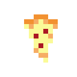
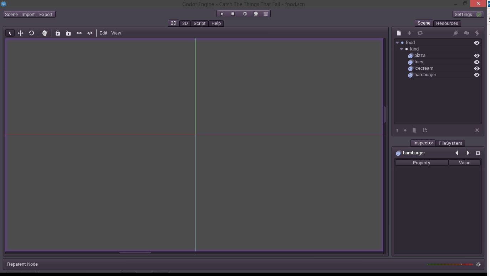

### Erythrina
# Coding more 

Here are we again. The last time we left our character moving, with some issues, but fine. Now we need a purpose to move, and that's to catch food. So let's start.


## The falling food

In first place we need the sprites and animations for our food. Let me draw some of them.

   

Now we could just put that food inside our scene but there will be a problem, there will be only one instance of it, and we may need many of them. And here is where one interesting aspect of Godot comes in, nest scenes. 

At first a scene would seem only like a place where our entities reside but here everything that could be encapsulated could be a scene. For example our food will be another scene here, yes. Then we can just instance by copy and paste our food as many times as we want. Remember that *scene* is just a term.

We could create a scene for each kind of food but because all that food has the same logic we will make only one from which we may select which kind of food is. So lets create a new scene and call it "food.scn".



Also we have populated it with some nodes, for the different foods. One important thing to remember is that our scene is represented by it's root node. Because of this we made its root node a *Node2D* so we can move it around.

Let's fill the frames of the animations.


Here, because the animators all have the same animations, we could have used only one, but we didn't get to that for now. So lets go to the script magic stuff to select which food leave.

 We add a script to our root node and we create a function called, hmmm, `filter_food(name)`. That will make it.

```python
extends Node2D

func _ready():
	pass
	
func filter_food(name): 
	# I wish that it were that easy in real life
	var foods = get_child("kind").get_children()
	for food in foods:
		if food.get_name() != name:
			get_child("kind").remove_child(food)
``` 

And yeah, after a call each food which is not the desired one just goes away. 

Now we have to spawn that food from the skies. Let's go to our level1 scene again and add a *Node2D* called "food_spawner".

> Tip:
> Using Ctrl+Shift+P we can quickly switch back to the previous scene.

We also can create instances of other scenes like creating new nodes from the editor. Just clicking here. 


We could, and we will, create the instances programmatically, because we love to do it that way. Or another common approach is to create all the level food 2 kilometers high and then just make everything fall. Here we will benefit from the animator and use one to spawn all the food of all the levels we want. We know how to chain animations and all that stuff so it will be easy. Now we only need a function to spawn some food in a given position. And to do so we will add a function called `spawn_food(type, x_offset)` in a script inside the food spawner. 

```python
extends Node2D

func _ready():
	pass

func spawn_food(type, x_offset):
	var food_scn = load("res://food.scn")
	var food = food_scn.instance()
	food.filter_food(type)
	food.set_pos(Vector2(x_offset, 0))
	add_child(food)
```

That will load a scene using the function `load(file)`, create an instance of the food, filter it, move it to a desired position, and then, most important of all, will append it to an existing node in the scene. If we do not append it to an active node our food will never exist. Here we will append it to the same "food_spawner" node but it could be appended anywhere. The coordinates are also relative to the parent node so when we move the `food_spawner` the spawn point will also move.

Another thing that we should do is to, instead of using the `load(file)` function, use the `preload(file)` function and store the preloaded scene in a variable. This is recommended here because we use the food scene a lot, but if we need to instance something one time each, much time, it's better to use load. When the scenes will turn huge, we will need to manage them properly.

Now that we are done this, we can use this function inside an animator. 


> Tip: 
> We can duplicate keyframes in a animation using Ctrl+D. To do this we need to select a keyframe (it will turn white), go to the desired position and then press Ctrl+D.

This works great, for now. Maybe tomorrow we could make a script which randomly generates food based on a rising difficulty level. But tomorrow, now this works. Let's go and see how well it wor... oh... 


Yes, our food just spins in the air and does not fall. We need it to fall, constantly at the same speed. So we will add a little more of logic to the food script.

```python
extends Node2D

var speed = 50.0

func _ready():
	set_process(true)
	
func filter_food(name):
	var foods = get_child("kind").get_children()
	for food in foods:
		if food.get_name() != name:
			get_child("kind").remove_child(food)
	
func _process(deltatime):
	var pos = get_pos()
	pos.y += speed * deltatime
	set_pos(pos)
```


Be careful with exporting the `speed` variable. If we export it it will be modifiable  from outside and it will also hold it's last value. Here we do not have any instance in which modify that value and the results were (at least for me) a little unpredictable. 

Now we move our food spawner up above the sky and then food will rain.


Yeah, we are almost done. Now we need to actually catch it.


#### Next topic, collisions and stuff, is now aviable --> [HERE](07_coding_even_more_aka_the_fat_guy_returns.md) <--

P.d.: Whoever who has read this, sorry for the long break.