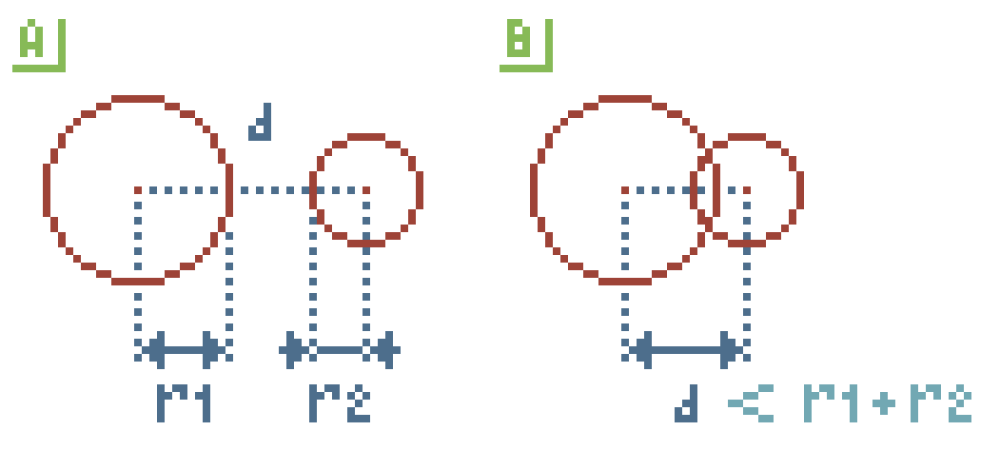
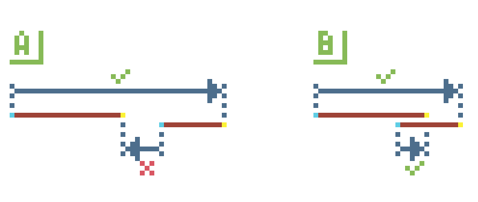
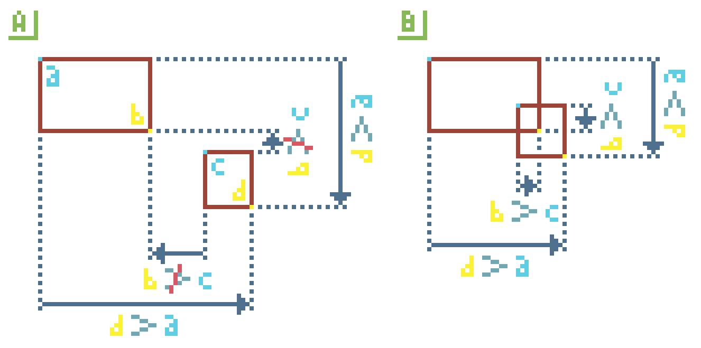
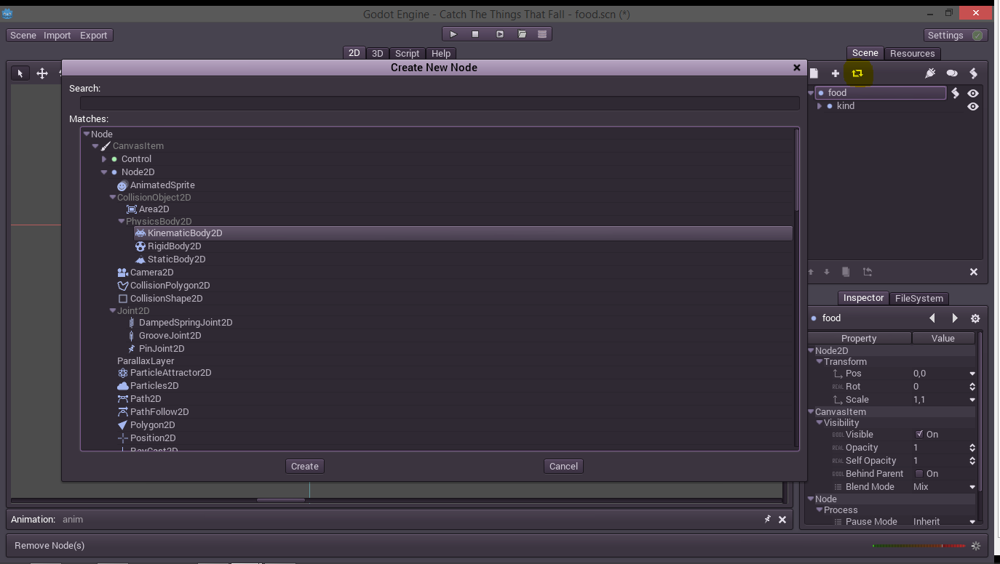
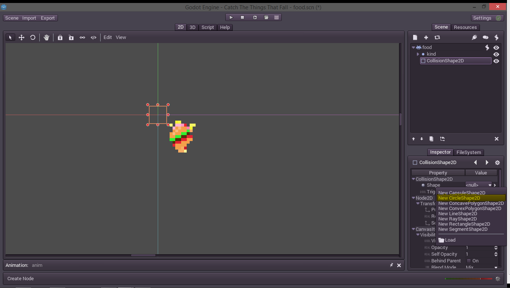
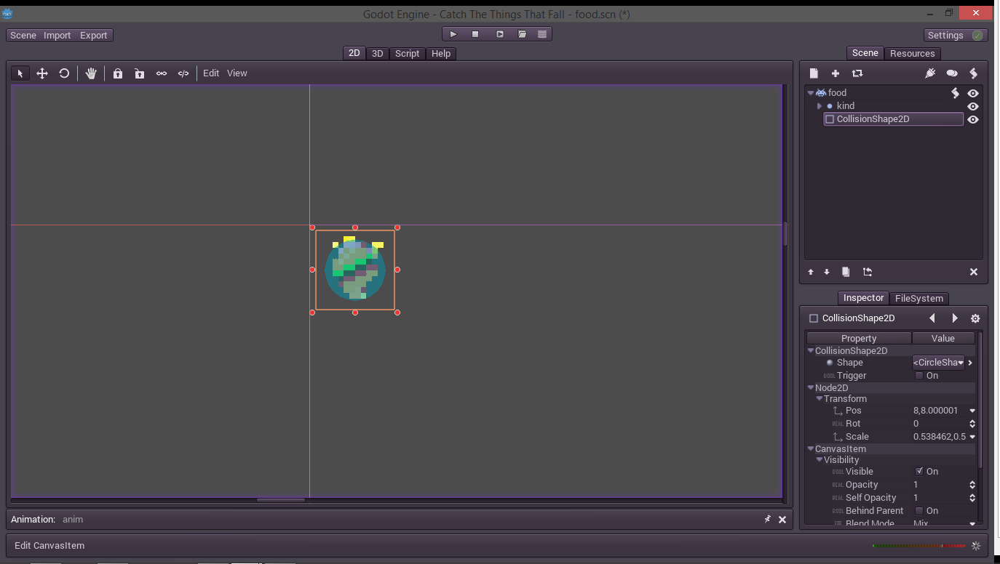
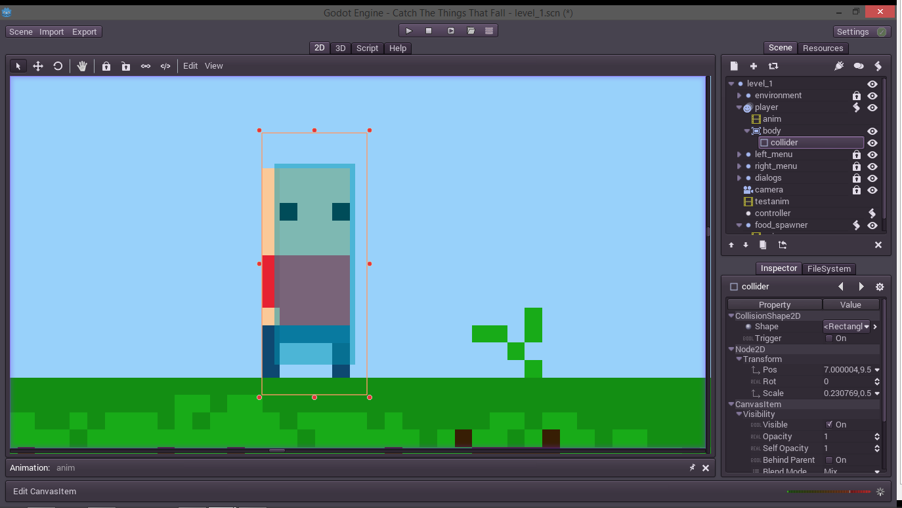
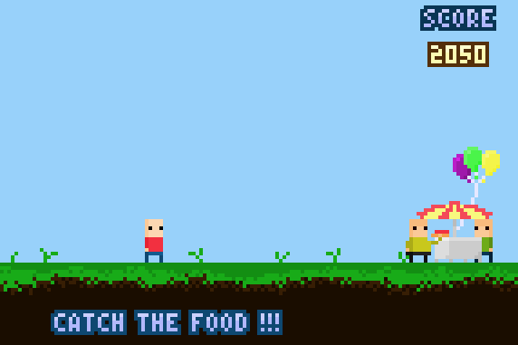
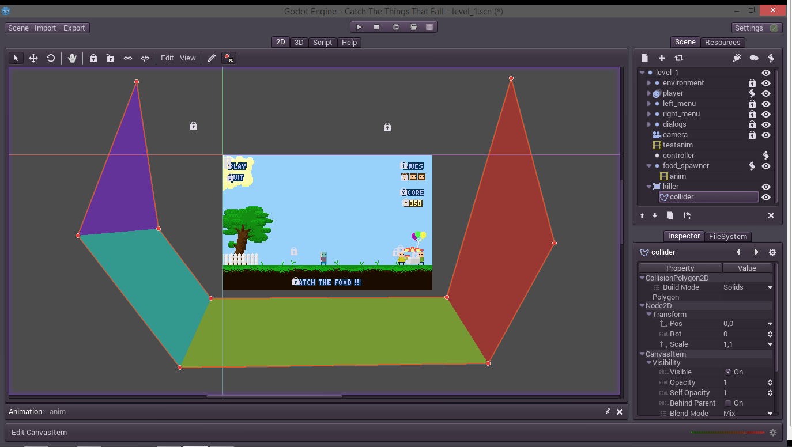

### Erythrina
# Coding even more

I'm back, I guess. At least to finish this. Because not for nothing I wrote _"But first, and important, we have to finish everything in that list so we can enjoy our little finished game"_. I would be pedant if I do not finish it but I've been complicated the last days. At least the conscience hurts everyday and that's a good sign. So let's finish this stuff.

## Collisions, the basic collisions

Yeah, if we want to catch the food, we need to actually collide with it. And once again Godot helps us having all the stuff we need to accomplish that. It actually has a whole physics engine but we will not fully use it, today, because we, ehm, let's say it's too much for a hamburger which falls. (Actually it's a lie, we could do awesome stuff with it and it's not complicated but I should explain the basic stuff in first place).

Let's first explain the basics of a collision, or the basics basics. 

One object collides with another when it touches it, or in our case and to simplify a little, when it overlaps. (In real world things do not overlap, do not try at home, you will end up trying to do [nuclear fusion](https://www.youtube.com/watch?v=O5_WvmQiqz0) and trying to smash two hydrogen atoms in one helium)

So if we think about it, the only thing we need to know is when two shapes overlap. Once again for simplicity we will think that our shapes are only rectangles, and circles.

If we need to check if two circles overlap it's actually very easy. If distance between both centers is smaller than the sum of both radius they overlap. 



In figure `A` the distance `d` is bigger than `r1 + r2` so they are far enough to do not touch. But in figure `B` we see how they "collide".

With basic maths and with the help of Pythagoras we can calculate the distance between two points based on the x and y axis and we are done. Thanks Pythagoras!

Then we must deal with the rectangle collision, and again this is simple also, if we constrain everything a little bit more. Our rectangles will be short called **AABB** because they will be Axis Aligned Bounding Boxes. What does that means? Merely that our rectangles will not rotate. (If we want them to rotate we should or a) apply a transformation for each point we want to test or b) define a collision with polygons which is the best way and I want to cover that, later)

Because our rectangles do not rotate the problem is the same as looking if two segments overlap in 1 dimension. We need to check any of the two points of one segment is between the other two points of the another segment. And then with magic and simplification we end up looking if the right point of the segment is bigger than the left point on the other segment and vice versa.



And believe or not, if we have the segments `AB` and `CD` then `D > A && B > C` it's enough to know if they overlap. Then we can expand this to an AABB and do the same on each axis (yes, this also works in 3D for cubes!!).



The graphic is not clear as I would expect but it's the same as above, if you look at it gently and then turn the head 90 degrees. 

Thinking in an implementation, we could put everything in a single `if` with something like:

```python
var r1, r2  # our rectangles
var a = r1.position
var b = a + r1.size
var c = r2.position
var d = c + r2.size
if d.x > a.x and b.x > c.x and
		d.y > a.y and b.y > c.y:
	# COLLIDES!!
```

Yeah, we did it!! Many 2D games don't need anything more than this simple collision checking. Think in mario and how you can replace him with a red bouncy rectangle, which hits rectangles with his square head and jumps over little goombasquares.

But then you think that something is missing. How I check if a rectangle collides with a circle. Well, it starts to complicate from here. There are two common ways a) treat the rectangle as a polygon and check with another method which I will not explain now or b) check all the the rectangle faces and then check each vertex. But our game actually does not need this kind of collision so we can just continue.

Now that we know how it works, at least the basics, we could use it in our game and check if every piece of food collides with our player or... just use some of the Godot's stuff instead. 

Godot has Shape2D which is an object which can check if it overlaps with another object but unfortunately that object is not a node so we cannot use it from the editor, at least directly. Instead of that we have to create a CollisionObject2D and inside it create CollisionShape2D or CollisionPolygon2D nodes which will define its colliders but will transform into Shape2D objects on runtime. 

On the other hand all the nodes which inherit from CollisionObject2D are full-featured and fulfill a role in the physics engine. And as funny as it seems if we want to only use some shapes to check out if they overlap we need to a) use the engine and use an Area2D in couple with a PhysicsBody2D or b) refuse to use the full pyhisics engine and use a custom node which should inherit from CollisionObject2D and with a little code from grandma will work only to check overlapping between shapes and/or points (e.g. a click over a polygon).

I've done the (b) myself and it works but for the sake of understanding how godot works and because that would be a workaround for the engine I will go with (a). 


## Colliders and bodies

There are 3 types of bodies in Godot. We have the StaticBody2D which don't do anything more than stay in some place, and other non-static bodies collide with it. They can overlap and an Area2D (later) doesn't detects them. They are wonderful as environment as they don't consume any CPU on processing.

Then we have the RigidBody2D which is simulated step by step by the physics engine. They collide, bounce, fall by gravity and all the fancy stuff. Like the KinematicBody2D, it's detected by Area2D.

And our last body is the KinematicBody2D which is something like a.. ehm.. a manually-simulated body. It's used mostly for player-like entities which generally don't requiere all the physics stuff, but instead a complex behaviour which may break physics, like a robot doing a double jump, then going down fast like a bullet. Because the process and simulation is coded by the player they use nothing of CPU if you desire.

In this case we will use a combination of a KinematicBody2D for the food and the stuff, and an Area2D for our player. The Area2D is the last CollisionObject2D and it detects physic bodies which overlap with it, but does not collide. Also it has a fancy behaviour which is to override the space settings like gravity and density.

Let's start with the food.



We will replace the food node type with a KinematicBody2D so we can detect collisions directly with the food. Then, in order for the body to work, we have to add another child node as the collider. It's simple as going to the food node, and adding a CollisionShape2D as a direct child.

Then we have to select a shape for it.



Easy as going to the drop down and boom. A new shape was created. We just scale it to the size of our food and we are done.



There is it, we actually do not need a single line of code, at least for this thing.

Now we head to do our player collider, but we find that we can't change our player node type, because we are using it as an AnimatedSprite. As general rule I prefer using the sprite inside the physics body, it's easier because you will simulate and rotate the parent and then the sprite will be affected. But because here we do not need to simulate anything I will create an Area2D node called "body" inside our player node.



Then I've created a CollisionShape2D with a rectangle and scaled it over our player. We are done, all the boring stuff of checking collisions is done automatically by the Area2D. In our player script, we only need to check that and see what happens. I've modified our `_process()` to dirty-test it like this:

```python
func _process(deltatime):
	var pos = get_pos()
	pos.x += speed * deltatime * heading_direction
	pos = bound_pos(pos)
	set_pos(pos)
	
	var bodies = body.get_overlapping_bodies()
	if bodies.size() != 0:
		for food in bodies:
			print("colliding with " + food.get_node("kind").get_children()[0].get_name())
```

And it works flawless. So we start to refactor some code and add a score, and a method for eating food. To actually know if what we are eating is food, we just preload the "food.gd" script and check if the object is instance of that script.


```python
var FoodType = preload("food.gd")

var body
var score = 0

func _process(deltatime):
	var pos = get_pos()
	pos.x += speed * deltatime * heading_direction
	pos = bound_pos(pos)
	set_pos(pos)
	
	var things = body.get_overlapping_bodies()
	if things.size() != 0:
		for thing in things:
			if FoodType.instance_has(thing):
				eat_food(thing)

func eat_food(food):
	if food.can_eat():
		score += food.get_score()
		food.explode()
```

Then I've modified the food script a little with these methods:

```python
var exploded = false

func get_score():
	var kind = get_child("kind").get_children()[0].get_name()
	if kind == "pizza":
		return 10
	elif kind == "icecream":
		return 15
	elif kind == "hamburger":
		return 25
	elif kind == "fries":
		return 5
	return 0

func can_eat():
	return not exploded
	
func explode():
	exploded = true
	get_node("explosion/anim").play("boom")
	get_node("kind").hide()
```

And added another AnimatedSprite with an AnimationPlayer to create a sparkle effect. At the end of the "boom" animation the animation player calls `queue_free()` of the food object to delete it from the scene.

And now we have this fancy stuff.



The last problem we have is that if we can not catch the food, it will fall forever until it reaches `MAX_FLOAT` and, maybe overflows and start to fall again, or maybe the player computer will explode.

So we will add another area, usually know as "killer" area. Because it kills anything it touches, or something like that, despite of its name it's actually a good area. 

Fear my mighty killer area! It's actually a bowl because maybe in the future, things will fly away and we'll need to handle it.



Then we add our killing script as "killer.gd":

```python
extends Area2D

func _ready():
	set_process(true)

func _process(deltatime):
	var things = get_overlapping_bodies()
	for thing in things:
		thing.queue_free()  # KILL	
```

Godot also has signal (event) handling, but for now I'll use an old school poll loop. 

And it's done, now we have the collisions with the food. Also we can substract score points when our little bald boy misses the food. 