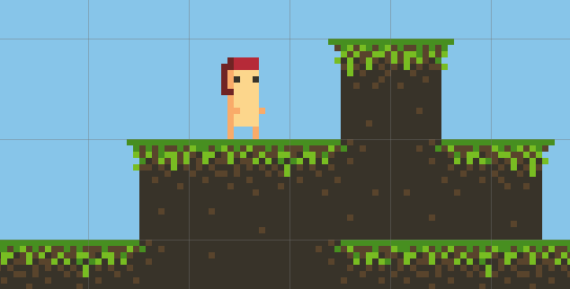

### Erythrina

# Introducción

Pero, ¿de qué va todo esto? Aparte de ser un manojo de horrores gramaticales y sinsentidos. Esto es (eso espero) una serie de tutoriales sobre el desarrollo de un juego 2D, desde cero hasta algo grande (De nuevo, eso espero), en Godot Engine.

Hay muchos temas que han captado mi interés y escribiré (o lo intentaré) sobre ellos
una vez por semana. Éstos van desde la creación básica de assets, pasando por trucos
útiles e ideas, hasta algunas coasa locas que yo mismo no he implementado todavía.

Ahora, el juego. OK, no hay juego. Todavía no. Iré desarrollándolo al tiempo que voy
escribiendo estos tutoriales, y se van subiendo a [github](https://github.com/jbat1jumper/erythrina),
de modo que cualquiera puede tener acceso al código y usarlo. Intentaré etiquetar
los commits de cada "punto de control" del tutorial de modo que sea fácil ver
el progreso del tutorial.

No hay argumento, sólo algunas ideas aleatorias hilarantes y un nombre que me gusta.
El juego sera 2D, porque 3D me intimida todavía, y será un juego de plataformas.
Relamente me gustan los juegos 2D isométricos mucho más, pero algunas veces
uno tiene que tomar una elección y continuar hasta al final. Intentaré convertirlo
en algo RPG como un juego con combate de ritmo acelerado. He probado poco de pixel art
y lo he encontrado sencillo para casi todo.

Es sencillo de animar, sencillo de dibujar, sencillo para hacer contenido.
Sólo hay un inconveniente que es demasiado simple y los pixels son demasiado grandes
de modo que algunas veces no es fácil representar alguna cosa. Como una cicatriz por ejemplo.
Pero eso no es un problema por ahora y realmente ejercitamos la creatividad.
Si no quieres hacer un juego pixelado sólo tienes que cambiar los sprites y ajustar
su tamaños y escalados.

## ¿Qué es lo siguiente?

La siguiente cosa en mi interminable lista de tutoriales es como hacer los sprites
y animaciones para este juego. Usaré <s>Graphics Gale</s> ASEprite porque es impresionante,
relamente me divierte userlo y puedo exportar de forma que encaja bien con Godot.

Después de eso haré el entorno y algunos tileset (juego de azulejos) usando Pyxel Edit
a lo podré todo junto dentro de Godot Engine para darle vida.

### Vamos a [empezar](01_making_assets.md)
