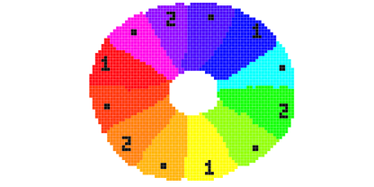
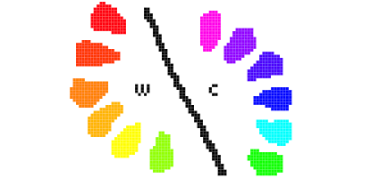
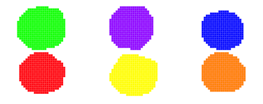
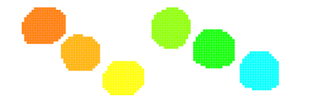
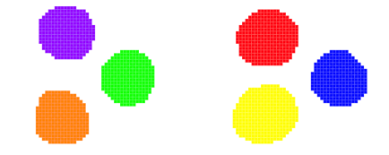
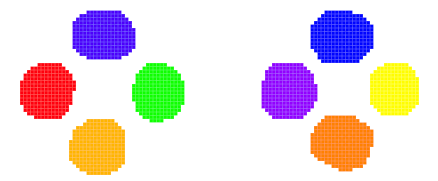
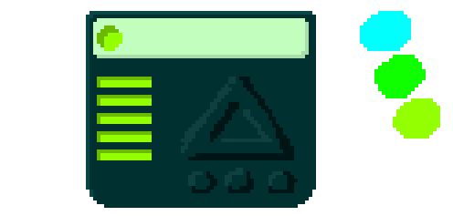

### Erythrina

# Creando los assets

El primer tema que cobriré será la creación de los assets. Intentaré usar programas
libres u open source. Quizás este tutorial cubrirá menos sobre Godot pero son
importantes para cada juego. Llegaremos a Godort en unWe will reach godot en solo un rato.

Estaba pensando en usar GraphicsGale para dibujar. No es un mal programa, tiene
una versión gratuita, etc. Realmente no me gusta porque no encuentro intuitivo
algunas de las herramientas aunque para pixel art no se necesita demasiado y
encuentro que encaja bien con los sprites animados de Godot. Pero justo hace poco
encontré ASEprite. Es un editor It's a pixelated editor listo para pixel art,
y además es open source.

Justo el abrirlo aparece toda la nostalgia. Al principio pensé que un entorno
pixelado sería molesto, pero una vez que lo usé me pareció cómodo. ASEprite
puede trabajar con capas, animaciones, exportar hojas de sprites, paletas, etc.
Y se ajusta bien con los sprite animados de Godot.

Para Windows estoy usando esta versión compilada - [Enlace al zip](http://www.mediafire.com/download/a2p5m91lndrfw4g/Aseprite1.0.2-dev.zip) -
porque los últimos binarios no son gratuitos, sin embargo el código se puede encontrar
aquí - [link to github](https://github.com/aseprite/aseprite/)

## Cosas que debemos conocer antes de dibujar

Antes de ir al desnudo acto de salpicar la pantalla de píxeles, hay algunas cosas
que debemos tener en cuenta. Aquí hay algunos trucos y reglas que pueden hacer el aspecto
de nuestro juego/diseño más profesional.

Un diseñador gráfico no tiene una varita mágica para hacer parecer todo maravilloso.
En lugar de eso, tienen un conjunto de reglas que, si las seguimos, podemos hacer
que parezca impresionante casi cualquier cosa. Y aquí tenemos un pequeño subconjunto
de algunas de las reglas que he aprendido hasta ahora. (Renuncia: no soy diseñador,
soy un técnico en electrónica y un estudiante de Informática de modo que cada
una de estas palabras debe cogerse con cautela).

## Cosas de la escuela primaria

Primero de todo, no se puede ir ahí y coger colores al azar.
¿Has tenido la experiencia de sentir cuando has hecho algo grande pero los colores
no se ven bien, y no sabes por qué?. Ahí justamente, es donde entra un poco de teoría de colores.
Necesitamos atravesar un poco de materia básica y aburrida.

Supongo que todos conocen los colores elementales y básicos.

Sí, no estamos usando el rojo, verde y azul como todas las pantallas CRT suelen hacer. Es verdad que RGB son los colores primarios para las pantallas y también que el rojo, amarillo y azul  son colores primarios también, ¿cuál es la diferencia?.

¿Qué ocurre cuando RGB son colores de luz y RYB son colores del pigmento?. La diferencia entre ellos es cómo y qué ocurre cuando se mezclan.
Con RGB cuando se mezclan todos los colores con máxima intensidad, el resultado es la luz blanca. Pero cuando se mezcla pintura roja, azul y amarilla se consigue un cubo de pintura marrón.

La pintura roja, amarilla y azul son los colores básicos. Cuando se mezclan en parejas se obtienen los colores secundarios.

Y si mezclamos un color primario con uno secundario, se crean los colores ternarios. Y después de eso, haciendo todas las combinaciones acabamos con una fantástica rueda de doce colores.

Podríamos continuar pero 12 colores es todo lo que necesitamos. Realmente más colores transformarían todo en algo peor.

Pero, no podemos hacer todo el juego con sólo 12 colores. ¿O sí? ¿y dónde están el negro y el blanco?

Bueno, para los físicos, el negro no es un color pero el blando sí. Para los químicos el negro es un color pero el blanco no. Pero para la teoría de los colores básicos, ninguno de ellos son colores.
Son solamente variaciones de intensidad y luminancia de un color. Añaden sombra (al agregar negro) y tinte (al agregar blanco).

Girando la rueda de colores y cambiando el color, se está cambiando realmente el
matiz (HUE) del color. Cuando hacemos una rueda de 12 colores estamos restringiendo
los matices a un pequeño subconjunto. Sin embargo todavía pondemos teñir y sombrear
los colores para hacer muchas variaciones.

Cuando un color no tiene agregado ni blanco ni negro entonces está completamente saturado.
A menor saturación del colorm, más negro o blanco tiene. El neutro podría ser cualquier color con saturación 0.

## Cálido y fresco

Una cosa que es importante conocer y es obvia a primera vista es la diferencia entre
colres cálidos y frescos.

La rueda de color se divide en dos secciones.

Es útil saber lo que estamos dibujando y qué sentimentos estamos tratando de transmitir.
Por ejemplo, los colores cálidos generalmente son vivos y enérgicos, mientras que los
colores frescos son calmados y triste en ocasiones. Trata de evitar mezclar colores
cálidos (al menos en cantidades iguales) cuando trates de dibujar algo que deba sentirse fresco.

## Selección de colores

La cosa más importante que hay que saber sobre los colores es seleccionar los menos posibles.
Hay que seleccionar la mínima cantidad de colores que represente el dibujo. Cuantos menos
colores se cojan, más 'armónico' lucirá el dibujo. Si se exagera cogiendo un único
color todo será monocromático y no habrá lugar para colores incorrectos (Sólo habrá un color).

Para algunas cosas elegir de dos a cuatro colores es suficiente. El resto son sólo
variaciones agregando negro y blanco.

Aquí vemos algunos consejos para elegir colores y algunos casos de uso.

##### Colores complementarios

Escoge un color base, luego coge el color opuesto en la rueda. Ese color será
el color complementario. Tendrmos el mayor contraste de tinte de modo que no se
recomienda usarlos con total saturación. Es muy útil para hacer cosas que destaquen.

##### Colores análogos

Elige un color base, luego coge el color adyacente en la rueda. Esta combinación
generalemente es muy armoniosa y agradable. Carece de contraster y requiere del uso del negro y del blanco para añadir contraste. Incluo puedes combinarlos con el color complementario para algo que deba ser realmente destacado.

##### Separar los colores complementarios

Elige un color base y luego, en lugar de elegir el complementario, escoge el análogo del complementario. Obtendrás casi el mismo contraste que con el complementario pero será más fácil de usar y más comfortable al ojo.

##### Triángulo de colores

Elige un color base y luego escoge otros dos haciendo un triángulo en la rueda de modo que los tres colores estén separados.

##### Square/Rectangle Colors

Elegir dos pares de colores complementarios. El resultado será bastante versátil para tener un buen contraste y buena armonía. Tendrás colores cálidos como colores frescos. Esta combinación funciona mejor si uno de los colores es el dominante.

Todos estos colores podrían parecer muy simples y coloridos. Pero todo lo demás está en la variación. Cogiendo un conjunto de colores análogos podríamos hacer algo como esto.

Realmente no sé lo que es eso. Pero en esa caso sólo hay tres colores todo lo demás es
teñir y sombrear. And that colors are the same (have the same hue) that the ones on the right. It blew my mind the first time I saw it.

If you want to draw something more realistic you are not restricted to a small set of colors, but they will help as guidelines for the other colors. You always can use a base paint in basic colors and then paint more colors, shadow and light over until everything look gorgeous.

## Now the drawing thing

So, now we are ready to go and dive into the drawing thing. So we sit, turn on the computer, and open ASEprite. The first thing we see is an environment like this.

Its actually a lovely environment once you get used. Then you go to create a new file in aseprite and find a menu like this one.

And maybe you will ask yourself which color mode use, or which background color. For pixel art one great tool (at least for me) is an indexed color palette. You are limited to 256 colors, yes, but they are plenty enough. The gain is that when you want to change one color, or adjust all the palette colors over all the sprites, you will only need to change the palette. You do not need to repaint anything (theoretically).

This leads you to make a palette shared between all the images. Or maybe to use different palettes for different purposes (like a palette for normal environments, and another for cold environments where all the colors are tinted in blue). And that will be the first thing we will do.

Actually creating a palette from scratch is a continuous process where you add colors when you need them, and that is fine. But here I will cheat and make a (I hope) complete palette from the twelve colors from the color wheel. Then tweak it to give everything the desired look and use it everywhere so the colors will be consistent over all the assets.

I'll start by cleaning ant throwing away the current palette. By clicking here on the edit palette button.

It will expectably open a palette editor like this one, where you can edit each color.

But editing each color one by one is a tedious process, and if you click on the + button, some useful tools will open.

To erase all the current colors easily you can actually select a big group of
colors. Holding ctrl or shift, like with files or everything similar, will select a group of colors.

Then just move all the RGB sliders to 0 to make all colors black. Now we have a nice and empty palette and we are ready to create.

I use the colors in the HSB (HSV or HSL, whatever) mode. It actually reflects well the basic color theory.

First of all I will make a gray gradient. I will let the first row empty if I may need some specific colors at some point, to made color annotations and to use the first color as the transparent color. I select the 9th color and make it white. Then I will select the last 24th color (the last of the third row if you live in a universe where the rows have 8 colors, and if you not you can scale them) and make it black (if it isn't black already).

Then just select that 16 colors from white to that black, and then press the Ramp button.

It will make a nice gradient with equal size steps and will make our grayscale.

Then we will continue with the colors. Those are a little harder because they can lerp in more than 1 dimension, and generally the saturation and the value make a triangle or a square. I will make it dirty and simple choosing colors in this way.

So I will sacrifice full saturated colors (I will not use them here for now) and some gray tones (I will miss them).

I will proceed like with the gray scale but making two ramps and tweaking them a little.

First lets start with the red. Its hue is 0 so I think its a good start. I will first make a gardent from these colors.

And they will go from an almost black dark red to a red which is not saturated and does not harm the eye when watching. And the result is something like this.

After that we will make the light part of the gradient between these colors.

And the result is something like this.

Then there goes a boring but actually fast job of doing this for the rest of the 12 colors. Its actually just copy and paste simple as selecting the two rows of the red gradent, and then pasting it eleven times.

And after ten more times.

Then to change the hue of a hole gradient its just easy as select the gradient and simply change the hue.

And again we will do this like ten more times, and end up having this.

After that I will actually cheat all the hues a little bit moving some of them like 5 degrees. And with white colors I will make a row marking the columns of tones which are likely to use as base colors. And the other ones will be more likely to be used as shade or light colors. The whole result its in the assets folder, also exported as a .gpl pallete.

### Continues in the [Part 2](02_making_assets.md)
